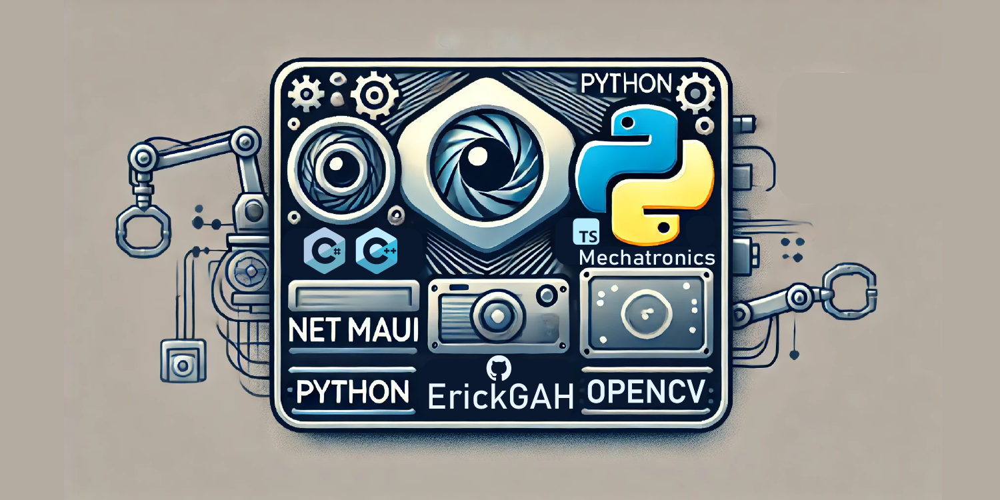

## Hi there 👋

# 

# Welcome to my repository! 👋

Hi, I'm a **Mechatronics Engineer** passionate about software development and the **integration of hardware and software**. This repository showcases some of my projects and contributions in areas such as:

- **Cross-platform development** with **.NET MAUI**
- **Computer vision** using **Python** and **OpenCV**
- Advanced programming in **C#** and **C++**

I'm enthusiastic about **exploring new technologies** and always eager to learn and innovate in every project I work on. Here, you'll find examples of my work, reflecting my focus on creating intelligent and efficient solutions.

If you have any questions or suggestions, feel free to contact me at **erick.g.alvarez.hdz@gmail.com**. I hope you find what I've shared useful!
